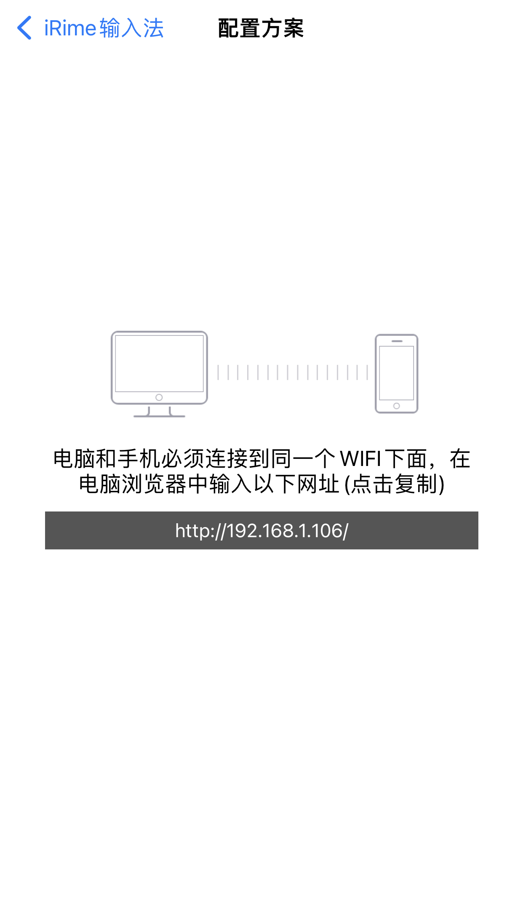
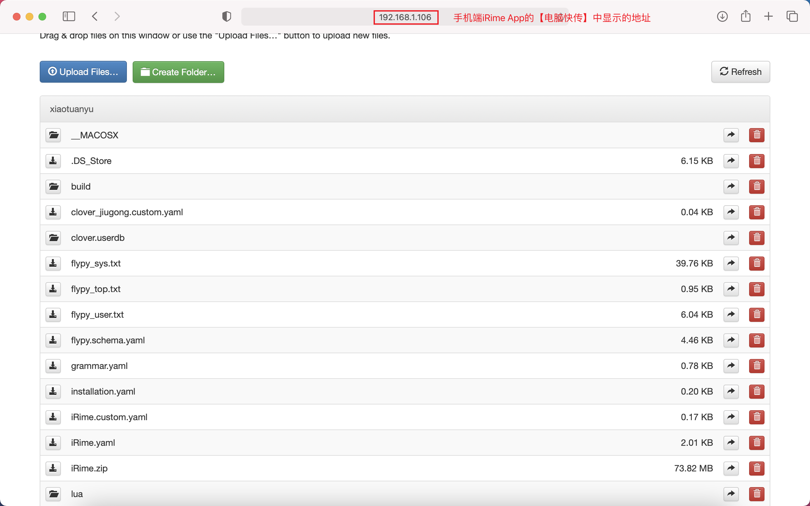

## iRime部署新方案示例
> 此处以IOS 15示例，Android原理上相通。

### 1. 安装iRime客户端
在Apple Store中安装iRime客户端
> Android请自行根据手机品牌来搜索下载iRime客户端

### 2. 添加iRime键盘，并进行完全访问授权
#### 1) 添加iRime键盘
设置 » 通用 » 键盘 » 添加新键盘（选择iRime输入法）
#### 2) 进行完全访问授权
设置 » 通用 » 键盘 » iRime输入法（打开允许完全访问开关）

### 3. 上传自选方案
#### 1) iRime自带方案
打开iRime App，在【选择方案】选项中，可以看到所有目前加载的输入方案列表

#### 2) 如何上传自带方案
iRime上传自带方案的方式，采用的是电脑上的方案文件上传到手机端的方式。
> 注意：
> - 前提要确认手机和电脑在同一个wifi网络中

- STEP 1:  打开iRime App，点击【电脑快传】，会显示下图
- STEP 2：在PC端，在浏览器（此处以chrome为例）的地址栏中输入上图中的ip地址，界面如下图
> 注意：
> - 电脑上传期间，手机端的iRime App必须处在打开状态
> - 如果点击【电脑快传】提示消息是“启动服务器失败了！请重试一下。”，可以杀掉iRime App后台，重试一次。

- STEP 3：点击PC浏览器显示界面上的Upload Files（上图中的蓝色按钮），然后选择需要上传的文件即可
> 注意：
> - PC浏览器中第一次打开上传界面，属于是iRime App的`根目录`，默认情况下，将方案文件（例如double_pinyin.schema.yaml）上传到`根目录`即可。
> 在某些DEBUG情况下，可能需要切换到不同子目录中，这个届时大家按照自己的需求用鼠标点击目录名称切换即可，如果你不清楚自己是否需要切换到子目录，那么大概率你就只需要保持在根目录不需要切换就行了。

#### 3) 需要上传些什么文件？
- default.custom.yaml，rime的用户自定义配置文件
- xxxx.schema.yaml，rime的方案配置文件
> 注意：
> - 在上传文件之间，先确认原来的文件是否存在，若存在，请先备份，再删除，然后在上传！
> - 不需要准备default.yaml文件

#### 4) 重新部署
在iRime App中，点击【部署】，此时app会根据你上传的自定义配置文件开始部署，部署成功后，即可在【选择方案】中看到自己上传的方案
> 注意：
> - 部署输出结果会生成到`根目录`下的`build`中，可以通过检查这个目录中`是否生成了相关文件`和检查`default.yaml内容`来检查自己上传的方案是否部署成功

#### 5) 可能存在的问题
若遇到了提示部署成功，但是通过`［4) 重新部署］`中的检查方式检查后，发现并未生效的情况，此时可以采用自己在电脑上部署，将部署后生成的相关文件上传到`手机端的build目录`，并手动修改`手机端build目录`中的`default.yaml`来临时解决。